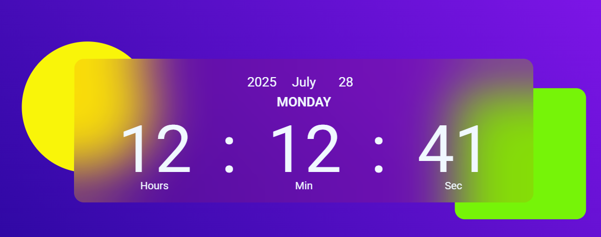

# digitalclock

digitalclock made with HTML, CSS, and JavaScript.

##  Project Tutorial

This project was created for learning purposes by following a tutorial by [GreatStack](https://www.youtube.com/@GreatStackDev):

➡️ [How To Create Digital Clock Using HTML CSS & JavaScript | Display Time Using JavaScript](https://www.youtube.com/watch?v=5tC46h022YE)

---

## Live Demo

👉 [View Live Demo](https://imileskiene.github.io/digitalclock/)  

---

## Technologies Used

- HTML
- CSS
- JavaScript

---

## Screenshot

---

## 📄 License

This project is intended for educational purposes only.

